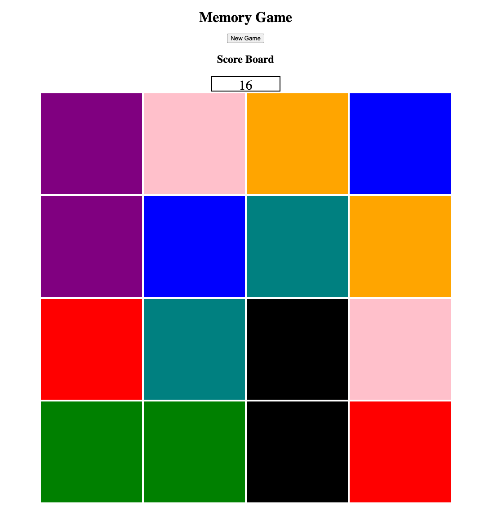

# Hoby's Memory-Game

This is a simple card/block matching game that anyone can play

The game has 5 rounds of 8 points each, matching a pair of colors equals 1 point

**Live Link:**
[Play the Game](https://hobylicious.github.io/MemoryGame/)

# Code/Technologies Used
* .html
* .css
* .js

# Hurdles
* Randomizing the color pattern was a more difficult task than ever anticipated

# Future Inclusions
* larger game board (6x6, 8x8, etc..)
* multi-player
* images instead of colors
  
# Known Issue(s)/Bugs
* If a user clicks a color/box after picking two colors that do not match, before they flip back to grey, the 3rd color/box can become stuck